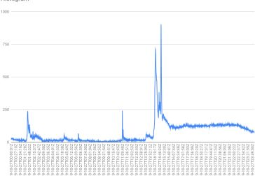
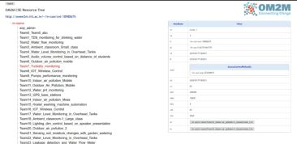
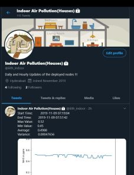

# Indoor-Air-Quality-Management
A complete Air Quality Index (AQI) sensing and management system designed and deployed in houses, to analyze the effects of outdoor and indoor events on indoor air quality, along with a Twitter service for constant updates.


## Components Involved
We list one by one, all the components involved in the usage -
### Using Microcontroller ESP8266
We used the ESP8266 Microcontroller as our primary microcontroller.

#### Desigining the case
We designed the enclosure for our model using Autodesk Fusion360 and 3D printed it at Product Labs, IIITH.


### Collecting and Analyzing Data
- We were able to accurately predict the cooking times after carefully looking at the data - 


Notice the spike, which is representative of the cooking period in the kitchen.
- We specially collected our data during the Diwali festival and noticed anomalies in the data - 


Notice the read peak and slight normalization after due process.

### OneM2M Usage
OneM2M was used as a common container for holding data and servicing REST APIs to and from.


### Twitter Alerts
Frequent time-to-time alerts were issued at this account [here](https://twitter.com/iiith_indoor). 



## Software Used
- The following software were used in our project and will be required to successfully replicate our product -
```
Arduino IDE>=1.7 - Used for microcontrollers.
MATLAB ThingSpeak - IoT data visualization platform.
Autodesk Fusion360 - For editing and visualizing CAD models.
EaglePCB - For desigining and exporting PCB.
```
- Apart from the above, please include all the sensor libraries provided in the `src/sensor_libraries.zip`. Refer [here](https://www.arduino.cc/en/guide/libraries) for the tutorial for installation in the Arduino IDE.
- To install the python libaries, please use the command 
```
$: pip install --user -r requirements.txt
```

Created by - 
Bhavyajeet Singh, Pranav Kirsur and Vikrant Dewangan
